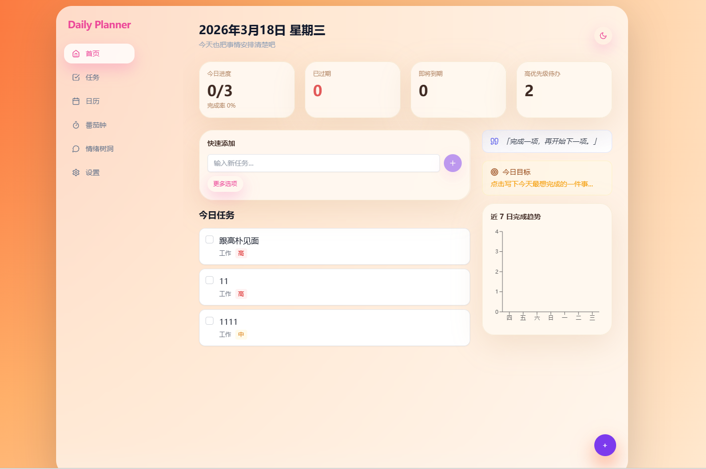
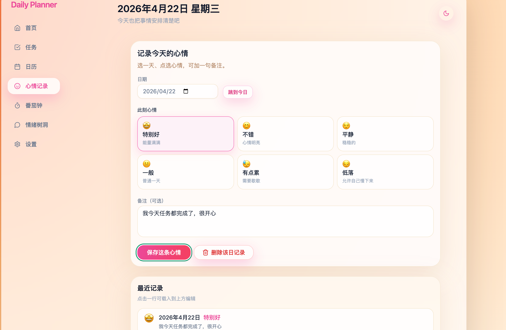
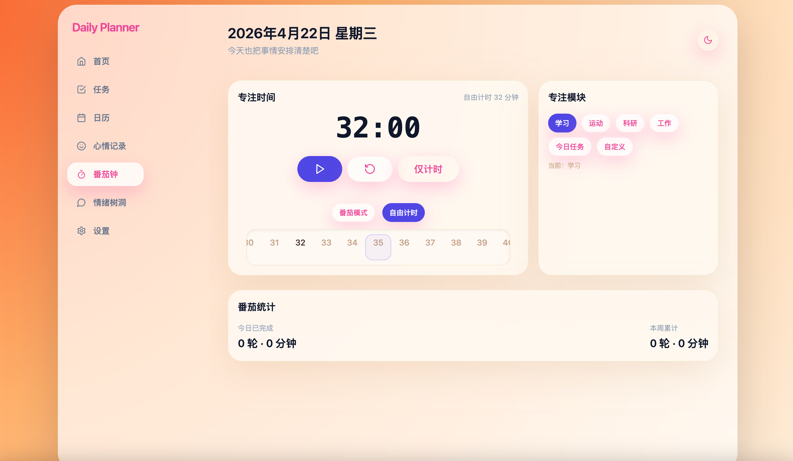
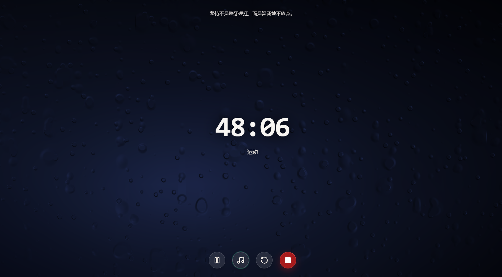

 📅 Daily Planner｜每日计划本

> 一个面向高压生活场景的个人效率工具  
> 将 **任务管理、情绪记录、番茄专注、AI 陪伴** 融合到同一个日常工作流中，让效率和情绪都被认真照顾。

---

## ✨ 项目简介

**Daily Planner（每日计划本）** 是一款为个人场景设计的效率工具。  
它不仅帮助用户管理每日任务、记录情绪、进行专注计时，也希望在焦虑、疲惫或分心时，提供一个更温和、更有陪伴感的使用体验。

相比传统待办工具，Daily Planner 更关注两个核心问题：

- **如何把事情做完**
- **如何在做事的过程中，不被情绪拖垮**

因此，项目围绕两条主线展开：

- **任务与专注管理**：帮助用户规划任务、进入专注状态、沉淀专注数据
- **情绪表达与疏导**：帮助用户记录情绪、倾诉压力，并获得更具连续性的 AI 回应

---

## 🌟 核心亮点

- 💬 **情绪树洞**：支持自由倾诉，AI 提供温和、非评判式回应
- 📝 **情绪记录**：按日期记录心情与备注，保留个人情绪轨迹
- ⏱️ **番茄钟 / 自由计时**：兼顾规律型任务与非规律型任务场景
- 🌧️ **沉浸式专注模式**：支持雨景 / 雪景背景与环境音，增强专注氛围
- 🧠 **RAG 记忆能力（规划中）**：让 AI 结合历史情绪记录，提升对话连续性
- 🛡️ **安全熔断机制**：识别高风险情绪表达，优先触发安全提示
- 🎨 **主题色全局联动**：在设置中修改主题色后，全局组件颜色同步更新
- 💾 **本地数据存储**：支持 JSON 导出与恢复，降低数据丢失风险

---

## 🚀 一键运行。https://daily-planner-lake-one.vercel.app/

## 🛠️ 技术栈

### 前端

* React
* TypeScript
* Vite
* Tailwind CSS

### 状态管理

* Zustand
* LocalStorage 持久化

### AI / 后端

* LangChain
* Gemini API
* Supabase

  * Auth
  * Vector Database
  * RAG 检索能力

### 部署与开发

* Vercel
* Cursor
* GitHub Copilot

---

## 🧩 功能模块

### 1. 首页（Home）

首页用于承接用户每天打开应用后的第一视角，集中展示当日信息、任务入口与状态总览，帮助用户快速进入“查看—添加—执行”的节奏。

**功能说明：**

* 展示当天日期与问候语，强化每日使用仪式感
* 左侧提供主要功能导航，包括首页、任务、日历、心情记录、番茄钟、情绪树洞、设置
* 顶部展示任务统计卡片，包括：

  * 今日进度
  * 已过期
  * 即将到期
  * 高优先级待办
* 中部提供“快速添加”输入框，支持用户直接录入新任务
* 首页主体区域展示“今日任务”列表，便于聚焦当日安排
* 右侧展示激励文案、今日目标提醒与近 7 日完成趋势，增强自我反馈感
* 右下角提供悬浮快捷按钮，方便用户随时发起新增操作

首页的设计目标不是堆叠信息，而是让用户在打开应用后的几秒内，迅速知道：

* 今天要做什么
* 当前任务状态如何
* 接下来应该从哪里开始


*首页：包含日期问候、任务统计、快速添加、今日任务、目标提醒与近 7 日完成趋势，作为整套产品的主入口页面。*

---

### 2. 情绪树洞（Emotional Tree Hole）

用户可以随时输入当前的情绪、压力或想法，AI 会基于共情式表达进行回应。
该模块强调“可倾诉”和“被接住”的体验，而不是单纯问答。

**功能说明：**

* 支持输入自由文本
* 支持多轮对话
* AI 回应偏向共情、安抚和陪伴
* 可结合历史记录增强上下文连续性（规划中）


*情绪树洞：提供一个低压力、可倾诉的对话空间，AI 以更温和的方式回应用户情绪表达。*

---

### 3. 情绪记录（Mood Log）

用户可按日期记录当天情绪状态，并补充备注内容，用于沉淀个人情绪变化轨迹。

**功能说明：**

* 支持按日期选择心情档位
* 支持 emoji / 情绪标签表达
* 支持填写备注
* 支持查看最近记录
* 支持点击历史记录后回填编辑


*情绪记录：按日期保存当天心情与备注内容，帮助用户形成连续的情绪观察习惯。*

---

### 4. 番茄钟（Pomodoro / Timer）

用于帮助用户进入专注状态，并对专注时长进行记录与统计。

#### 番茄模式

适合有明确工作节奏的任务场景，支持专注段与休息段切换。

#### 自由计时

适合时长不固定的任务，支持灵活选择 1–120 分钟。

#### 专注模块

用户可为一次专注绑定具体模块，例如：

* 今日任务
* 自定义任务
* 临时事项

便于后续统计不同任务类型的专注投入。


*番茄钟：支持番茄模式与自由计时，可结合具体任务模块进行专注记录。*

---

### 5. 沉浸式专注模式（Focus Overlay）

在专注过程中提供更强的氛围感，减少干扰，提高沉浸度。

**功能说明：**

* 支持雨景 / 雪景背景切换
* 支持环境音开关
* 支持暂停、继续、重置、提前结束
* 专注结束后可进行一次结算

**健康节奏设计：**

* 连续专注累计达到 3 小时后，弹出关怀提示并暂停
* 避免长时间过载，提高使用可持续性


*专注遮罩：在专注进行时进入沉浸式界面，通过动态场景与环境音减少打扰、提升投入感。*

  
*专注遮罩：雪景专注模式，支持一键切换场景，营造更柔和的沉浸式专注氛围。*

---

### 6. 安全熔断机制（Safety Circuit Breaker）

当系统检测到高风险情绪表达时，会优先中断常规 AI 回复，转而给出更安全的提示信息。

**功能说明：**

* 检测高危关键词
* 中断常规聊天逻辑
* 展示求助建议与引导语
* 可选记录风险日志（视项目配置而定）

> 该机制用于提升产品安全性，但不能替代专业心理咨询或紧急干预服务。


*安全熔断占位图：展示情绪树洞场景下触发高风险识别后，中断常规回复并给出安全提示与求助引导。*

---

### 7. 设置（Settings）

提供基础个性化配置与本地数据管理能力。

**功能说明：**

* 主题模式：浅色 / 深色 / 跟随系统
* 强调色切换（修改后全局组件颜色同步生效）
* 本地数据导出为 JSON
* 从 JSON 备份恢复数据（覆盖式恢复）


*主题色联动占位图：展示在设置中调整主题色后，按钮、标签、状态块等全局组件颜色同步变化。*

---

## 📁 数据存储说明

当前版本以**本地存储**为主，用户无需注册即可使用主要功能。

本地数据包括但不限于：

* 情绪记录
* 专注计时结果
* 设置项
* 本地任务数据

支持：

* 导出为 JSON 备份
* 从 JSON 文件恢复数据

> 恢复操作为覆盖式，请谨慎使用。

---

## 🔒 安全说明

本项目包含基础的高风险情绪识别与熔断逻辑，用于在特定场景下优先提示用户寻求帮助。
但本项目本质上仍是效率工具与陪伴型产品原型，**不构成医疗、心理治疗或危机干预服务**。

如用户出现明确的自伤、自杀或其他紧急风险，请优先联系当地紧急援助资源或专业机构。

---

## 🗺️ 后续规划

未来计划逐步完善以下能力：

* [ ] 引入登录与多端同步
* [ ] 增强情绪趋势可视化
* [ ] 增加专注数据统计面板
* [ ] 优化安全熔断策略与日志体系
* [ ] 支持更完整的 AI 陪伴式对话体验

---

## 👥 适用人群

Daily Planner 更适合以下用户：

* 学生 / 考研党 / 自学用户
* 高压办公人群
* 容易焦虑、分心或拖延的人
* 希望把“效率管理”和“情绪照顾”放在一起的人

---


## 🙌 项目定位说明

这是一个强调 **“效率 + 情绪支持”双主线** 的个人产品实践项目。
它不追求复杂的协作体系，而是希望通过更轻量、更温和的交互方式，帮助用户更稳定地度过每一天。

```

