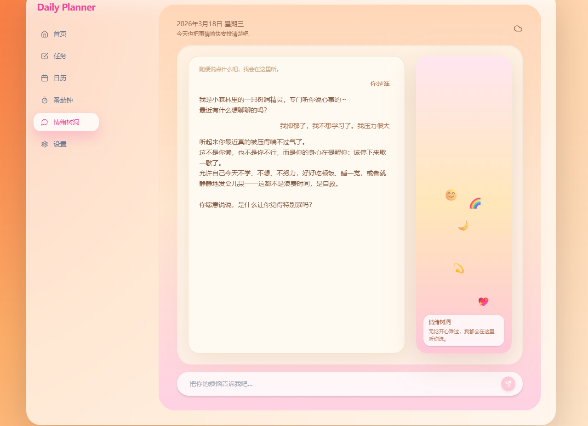
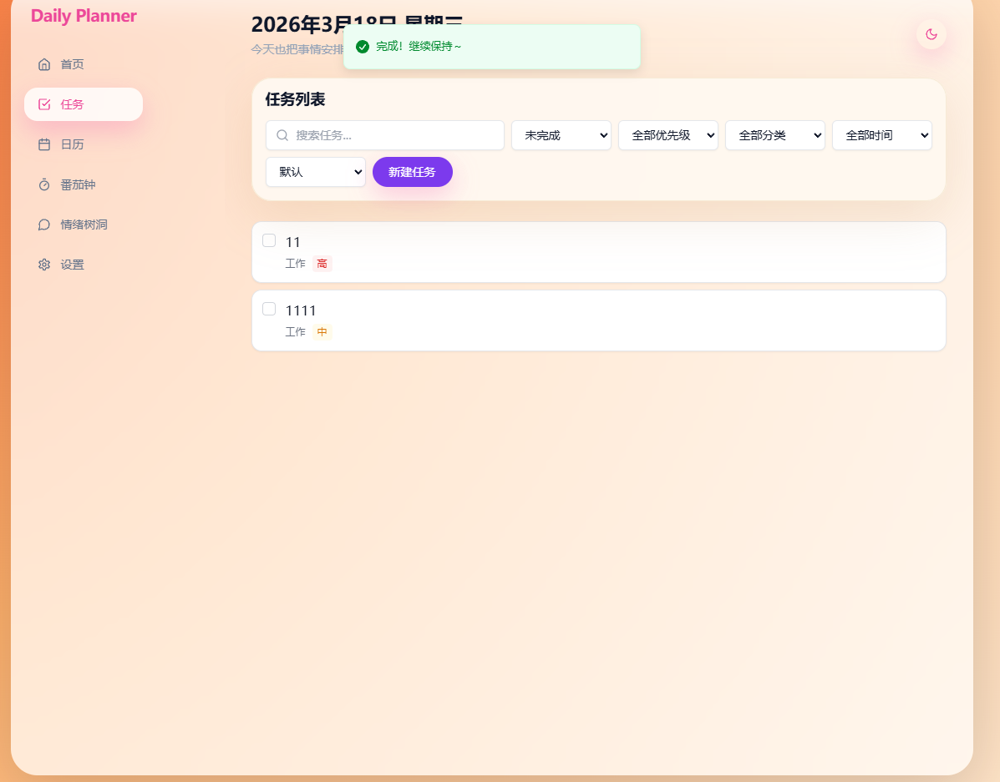

📅 每日计划本 | Daily Planner

> 一个专为高压人群设计的情绪疏导 + 任务管理双驱效能工具  
> **情绪出口 × 番茄钟 × AI 陪伴 = 更专注、更平静的每一天**

---

## 🌟 项目简介

「每日计划本」是一款结合 **情绪树洞** 与 **番茄工作法** 的个人效率工具。它不只帮你规划任务，更在你焦虑、疲惫时提供即时倾听与共情反馈，让你“边做事，边被治愈”。

- 💬 情绪树洞：随时倾诉，AI 陪你聊天，不评判、不打断
- ⏱️ 番茄钟联动：完成任务自动记录，可视化成就感
- 🧠 RAG 记忆引擎：记住你的情绪历史，对话更有连续性
- 🛡️ 安全熔断机制：识别高危情绪，强制干预，保障心理安全

---

## 🖼️ 项目预览


(./screenshots/st.png)
*首页：今日任务 + 情绪入口 + 番茄钟状态*


*情绪树洞：AI 共情回应，支持上下文记忆*


*数据看板：专注时长、情绪趋势、任务完成率*


### 本地运行

```bash
git clone https://github.com/liujiale012/daily-planner.git
cd daily-planner
npm install
npm run dev
访问 http://localhost:5173 即可体验。
技术栈
前端：React + TypeScript + Vite + Tailwind CSS
后端：Supabase (Vector DB + Auth)
AI 层：LangChain + Gemini API + RAG 架构
部署：Vercel
开发辅助：Cursor + GitHub Copilot
核心功能详解
1. 情绪树洞（Emotional Tree Hole）
用户可随时输入情绪文字
AI 基于心理学模型生成共情回复
支持多轮对话，记忆历史情绪标签
2. 番茄钟联动（Pomodoro Sync）
完成任务后自动启动番茄钟
倒计时结束弹出鼓励语 + 情绪询问
数据同步至个人仪表盘
3. 安全熔断机制（Safety Circuit Breaker）
实时检测关键词（如“想死”、“绝望”等）
触发后立即中断 AI 回复，显示求助热线 + 引导语
日志记录并标记为高风险事件（仅管理员可见）
